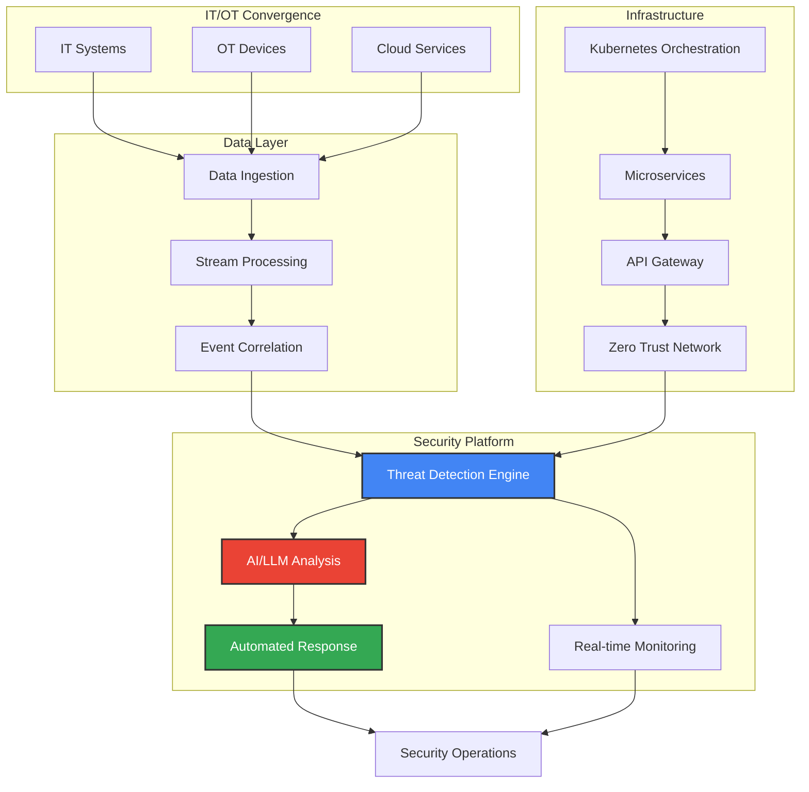

# Hi, I'm Brandon Cummings

**Director of Platform Development @ Léargas Security** | 25+ Years in IT & Web Technology

**Cybersecurity | AI/LLM Integration | Platform Architecture | Full-Stack Engineer | Technical Leader**

[](https://www.linkedin.com/in/rbcmgs)
[](https://twitter.com/rbcmgs)
[](mailto:b@cmgs.io)

---

## About Me

I'm a **Director of Platform Development** at
[**Léargas Security**](https://www.leargassecurity.com/), where I lead the strategy, architecture,
and delivery of security platforms across IT and OT environments. With **over 25 years of
experience** spanning the full spectrum of IT and web technology, I've evolved from hands-on coding
to technical leadership, always staying deeply connected to the engineering craft.

My career has taken me through:

- **Early Web Development** (late 90s/early 2000s) - Building dynamic websites and early e-commerce
  platforms
- **Enterprise Software Engineering** - Architecting scalable systems at **Dell**, **IBM**, and
  other Fortune 500s
- **Data Analytics & Visualization** - Transforming complex datasets into actionable insights
- **Cloud & Infrastructure** - Designing and deploying resilient, cloud-native architectures
- **Cybersecurity Engineering** - Building security platforms that protect critical infrastructure
- **AI/LLM Integration** - Leveraging artificial intelligence to enhance security operations and
  developer workflows

I believe in **secure-by-design principles**, **automation at every layer**, and **building systems
that scale**. My approach combines deep technical expertise with strategic vision, empowering teams
to deliver exceptional products while maintaining the highest security standards.

---

## The Journey: 25 Years in Technology

### 2020s - Cybersecurity & AI Era

**Director of Platform Development** | Léargas Security

- Leading cross-functional teams in backend, frontend, infrastructure, and security engineering
- Architecting IT/OT security platforms processing millions of events daily
- Integrating AI/LLMs for intelligent threat detection and automated response
- Driving secure SDLC practices and DevSecOps culture across the organization

### 2010s - Cloud & Scale

**Senior Software Engineer & Architect** | Various Organizations

- Modernized data analytics platforms for **Dell** and **IBM**
- Built scalable microservices architectures on AWS, Azure, and GCP
- Led migrations from monolithic applications to containerized, cloud-native systems
- Championed DevOps practices and infrastructure-as-code

### 2000s - Enterprise & Full-Stack Development

**Software Engineer & Team Lead**

- Developed enterprise applications using Java, .NET, and emerging web frameworks
- Built data warehousing and business intelligence solutions
- Led teams in agile transformation and continuous delivery practices
- Specialized in database design, optimization, and large-scale data processing

### Late 1990s - The Web Awakens

**Web Developer & IT Specialist**

- Created dynamic websites using early web technologies (PHP, ASP, Perl/CGI)
- Built e-commerce platforms and content management systems
- Managed servers, networks, and IT infrastructure
- Witnessed and participated in the dot-com boom and evolution of the modern web

---

## Current Focus & Expertise

### Technical Leadership

- Platform architecture & system design
- Security engineering & threat modeling
- Team building & technical mentorship
- Roadmap planning & delivery execution
- Cross-functional collaboration

### Security & Infrastructure

- IT/OT security platform development
- Secure SDLC & DevSecOps practices
- Cloud-native architecture (AWS/Azure/GCP)
- Container orchestration (Kubernetes/Docker)
- Zero-trust network design

### AI & Automation

- LLM integration for security operations
- Intelligent automation & orchestration
- AI-powered detection & analysis
- Natural language processing applications
- Machine learning model deployment

### Data & Analytics

- Data pipeline engineering
- Real-time stream processing
- Data modeling & optimization
- Business intelligence & visualization
- Log aggregation & observability

---

## Platform Architecture Approach



---

## Core Competencies

### Languages & Frameworks


### Cloud & Infrastructure


### Databases & Data Engineering


### Security & DevSecOps


**Expertise:** Secure SDLC, Threat modeling, Vulnerability management, Security automation

**Standards:** OWASP, NIST CSF, ISO 27001, CIS Controls

**Tools:** SIEM platforms, IDS/IPS, WAF, EDR/XDR solutions

### Development & Tools


### AI & Emerging Tech


**Focus:** Large Language Models (LLMs), RAG architectures, AI security applications, intelligent automation

---

## GitHub Statistics


---

## Professional Highlights

<details>
<summary><b>Certifications & Training (Click to expand)</b></summary>

### Security

- Security Engineering & Secure SDLC practices
- OWASP Top 10 & Secure Code Review
- Cloud Security Architecture (AWS/Azure)
- Threat Modeling & Risk Assessment

### Cloud & Platform Engineering

- AWS Architecture & Services
- Azure Cloud Solutions
- Kubernetes Administration
- Infrastructure as Code (Terraform)

### Leadership & Management

- Technical Leadership & Team Management
- Agile/Scrum Master practices
- Strategic Planning & Roadmap Development

</details>

<details>
<summary><b>Leadership & Mentorship (Click to expand)</b></summary>

- Technical mentorship and career development for junior and mid-level engineers
- Code review leadership and promotion of engineering best practices
- Cross-functional team collaboration and communication
- Driving engineering culture focused on quality, security, and continuous improvement
- Knowledge sharing through internal documentation and technical guidance
- Building strong team dynamics and fostering inclusive engineering environments

</details>

<details>
<summary><b>Notable Projects & Achievements (Click to expand)</b></summary>

### Security Platforms

- Architected and delivered multi-tenant security platform processing 10M+ events/day
- Built AI-powered threat detection system reducing false positives by 70%
- Implemented zero-trust architecture for critical infrastructure protection
- Led security incident response platform development with <5 min MTTR

### Enterprise Systems

- Modernized legacy data analytics platforms at Dell and IBM
- Designed microservices architecture supporting 100K+ concurrent users
- Built real-time data pipeline processing 1TB+ daily
- Led cloud migration reducing infrastructure costs by 40%

### Innovation & AI

- Integrated LLMs for automated security analysis and reporting
- Developed AI-powered code review assistant for development teams
- Built RAG system for intelligent security documentation search
- Created automated remediation workflows using AI decision-making

</details>

---

## What I'm Working On

```typescript
const currentFocus = {
    role: 'Director of Platform Development @ Léargas Security',
    building: [
        'Next-gen security platform with AI-powered threat detection',
        'LLM-driven security analysis and automated response systems',
        'Scalable microservices architecture for IT/OT convergence',
        'Developer tools and platforms for security engineering teams',
    ],
    learning: [
        'Advanced LLM architectures and fine-tuning techniques',
        'Rust for high-performance security tools',
        'Edge computing for distributed security deployments',
        'Zero-knowledge proofs and advanced cryptography',
    ],
    exploring: [
        'AI agents for autonomous security operations',
        'Graph databases for threat intelligence correlation',
        'WebAssembly for secure, portable code execution',
        'Quantum-resistant cryptography implementations',
    ],
};
```

---

## My Philosophy

> **Build for scale. Design for security. Lead with empathy.**

Over 25 years, I've learned that the best systems are built by teams that:

- **Prioritize security from day one** - Security is not a feature; it's a foundation
- **Embrace automation** - Automate toil away so humans can focus on creativity
- **Value simplicity** - Complex systems fail; elegant solutions endure
- **Practice continuous learning** - Technology evolves; we must evolve with it
- **Collaborate openly** - The best ideas emerge from diverse perspectives

I believe in **writing code that others can understand**, **designing systems that operators can
trust**, and **building teams where everyone can thrive**.

---

## Let's Connect

I'm always interested in discussing:

- Security architecture and best practices
- AI/LLM applications in cybersecurity and engineering
- Platform engineering and developer experience
- Technical leadership and team building
- The evolution of web technology over 25 years

### Reach Out

[](mailto:b@cmgs.io)
[](https://www.linkedin.com/in/rbcmgs)
[](https://twitter.com/rbcmgs)

---

> "Twenty-five years of experience isn't just about time—it's about evolution, adaptation, and
> continuous growth in an ever-changing field."

---


**If you find my work interesting, consider starring some repositories!**
